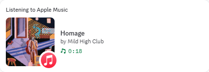

# Apple Music Discord Presence

A small personal project to show my friends what music I'm listening to on Discord, since Apple Music doesn't have a native Discord integration like Spotify does.

Detects the currently playing track from Apple Music in your browser (Edge, Chrome, or Firefox) and displays it as Discord Rich Presence on Windows, complete with album art, artist info, and playback status.

> **v0.1** | This app uses the Windows Media Session API, which detects the active media session on your system. It works with Apple Music in any browser (Edge, Chrome, Firefox) but cannot distinguish Apple Music from other media sources. For best results, only play Apple Music while using this app.


## Features

- **Real-time track display**: Song title, artist, and album on your Discord profile
- **Dynamic album art**: Fetched from iTunes and Deezer APIs (no API keys required)
- **Listening activity**: Shows "Listening to Apple Music" in your Discord status
- **Playback state**: Playing or paused indicator
- **Auto-reconnect**: Reconnects automatically if Discord restarts
- **Lightweight**: Single Python script, minimal resource usage

<!-- Add a screenshot here if you have one: -->
<!--  -->

## Setup

### 1. Create a Discord Application

1. Go to [discord.com/developers/applications](https://discord.com/developers/applications)
2. Click **New Application** and name it **Apple Music** (this name appears in your status)
3. Copy the **Application ID** from the General Information page

### 2. Install

```bash
git clone https://github.com/your-username/apple-music-discord.git
cd apple-music-discord
python -m venv .venv
.venv\Scripts\activate
pip install -r requirements.txt
```

### 3. Configure

```bash
copy .env.example .env
```

Edit `.env` and paste your Discord Application ID.

### 4. Run

```bash
python main.py
```

Press `Ctrl+C` to stop.

## Configuration

| Variable | Default | Description |
|----------|---------|-------------|
| `DISCORD_APP_ID` | *(required)* | Your Discord Application ID |
| `POLL_INTERVAL` | `2` | Seconds between track checks |

## Known Limitations

- **The elapsed timer is not the actual song position.** It counts from when the track was first detected. Seeking, rewinding, or restarting does not affect the timer. This is because Apple Music's web player does not reliably report position data.
- **Song details only visible on profile click.** The member list shows "Listening to Apple Music" but song title, artist, album art, etc. are only shown in the Rich Presence card. This is a Discord limitation.
- **Album art may not always be available or correct.** The search APIs return the best match, which may differ for remixes or obscure tracks. Unreleased or very niche tracks fall back to the Apple Music icon.
- **Cannot distinguish Apple Music from other media.** The app detects the active media session on your system. If other media is playing (e.g. YouTube, Spotify), it may pick that up instead.
- **Presence is cleared when paused.** Discord shows an elapsed timer that cannot be paused, so the presence is removed entirely when playback is paused to avoid showing incorrect time.

## Troubleshooting

| Problem | Solution |
|---------|----------|
| "Could not connect to Discord" | Make sure the Discord desktop app is running |
| No track detected | Make sure Apple Music is playing in Edge, Chrome, or Firefox |
| Rich Presence not showing | Check your profile popup or ask a friend |
| Album art missing | The track may not be indexed in iTunes or Deezer |

## License

MIT
